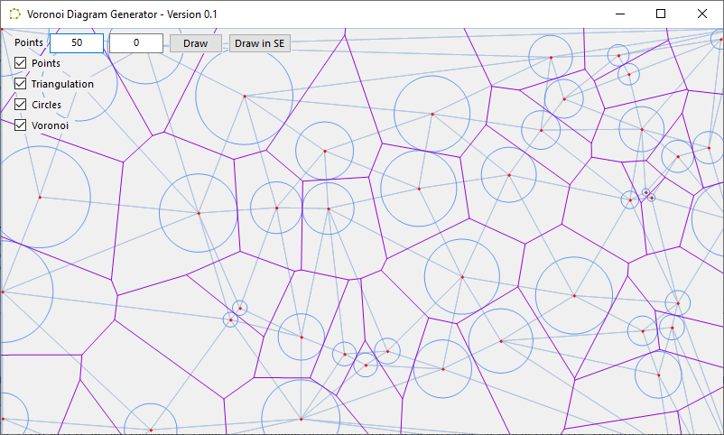
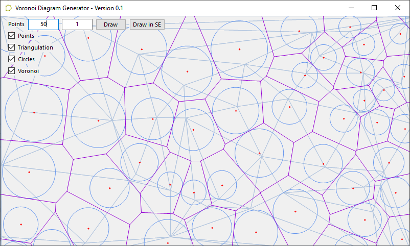
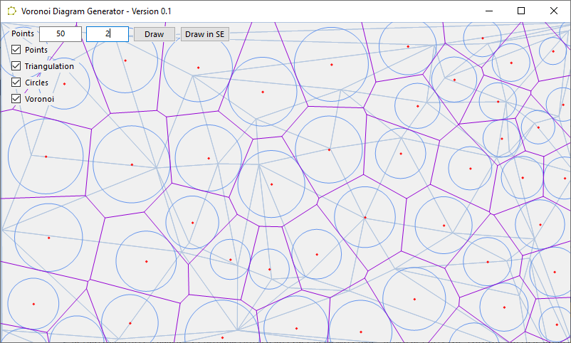
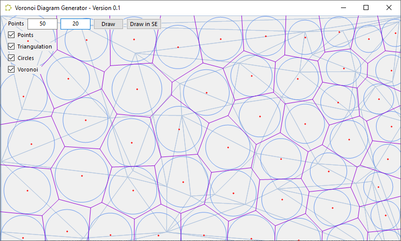
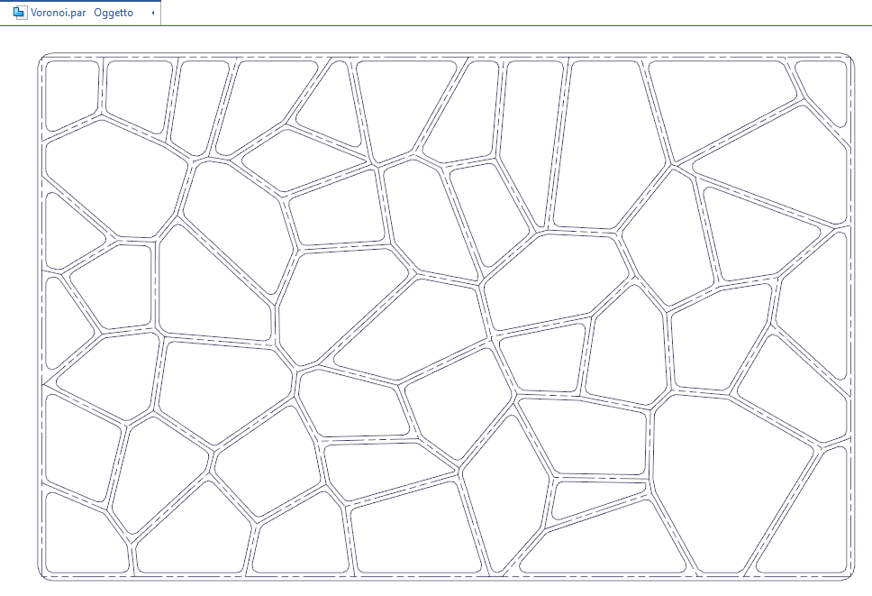
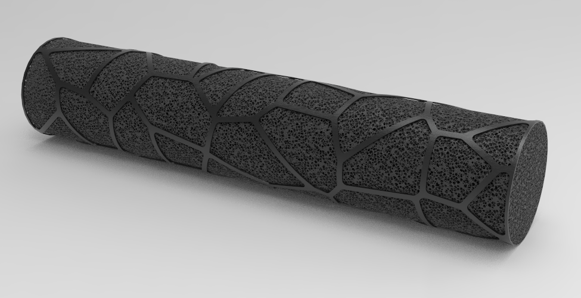

# SolidEdge-Voronoi
Voronoi diagram generator to Solid Edge sketch

Part of the code is adapted from https://github.com/RafaelKuebler/DelaunayVoronoi

# New release with relaxation and usage of the csDelaunay library
https://github.com/jfg8/csDelaunay

# VB.net Delaunay triangulation + Voronoi Diagram

A VB.net implementation of the [Bowyer–Watson algorithm](https://en.wikipedia.org/wiki/Bowyer%E2%80%93Watson_algorithm).
The result is a [Delaunay triangulation](https://en.wikipedia.org/wiki/Delaunay_triangulation) for a set of randomly generated points.
Following the Delaunay triangulation, the dual [Voronoi diagram](https://en.wikipedia.org/wiki/Voronoi_diagram) is constructed.

Releases here: https://github.com/farfilli/SolidEdge-Voronoi/releases

## License

This project is licensed under the MIT License - see the [LICENSE.txt](LICENSE.txt) file for details

## Acknowledgments

* [Procedural Dungeon Generation Algorithm](https://www.gamasutra.com/blogs/AAdonaac/20150903/252889/Procedural_Dungeon_Generation_Algorithm.php)
* [Polygonal Map Generation for Games](http://www-cs-students.stanford.edu/~amitp/game-programming/polygon-map-generation/)
* [Check if point is in circumcircle of a triangle (TitohuanT's answer)](https://stackoverflow.com/questions/39984709/how-can-i-check-wether-a-point-is-inside-the-circumcircle-of-3-points)
