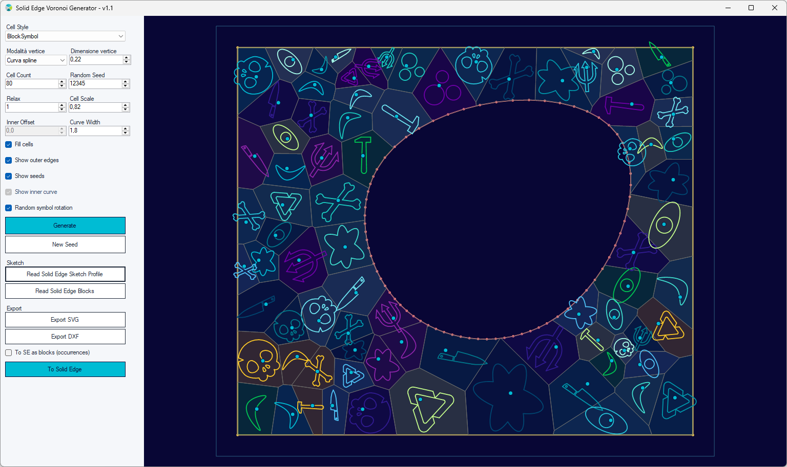
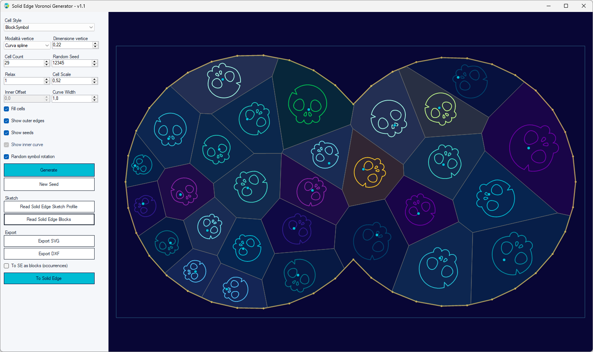
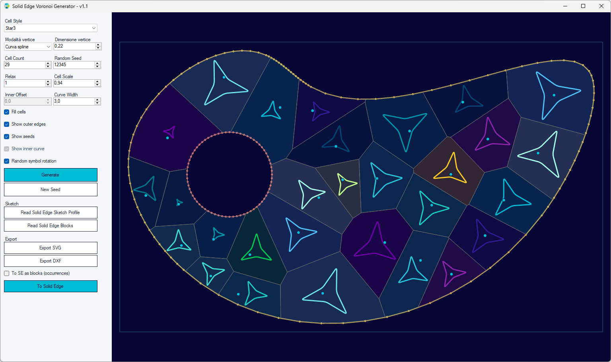
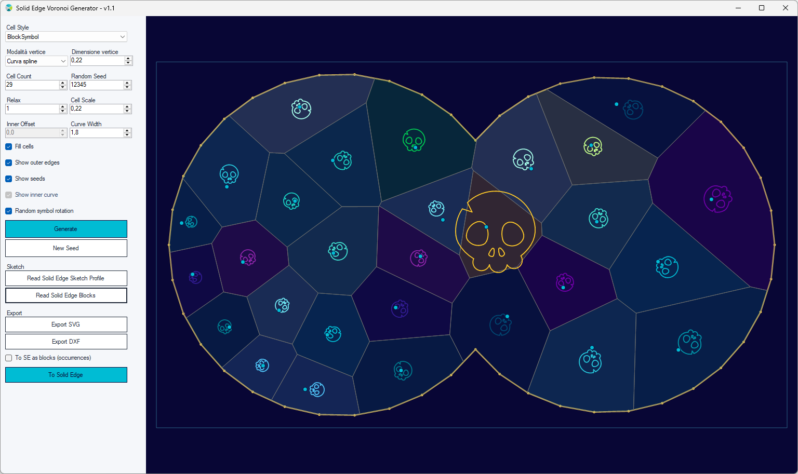
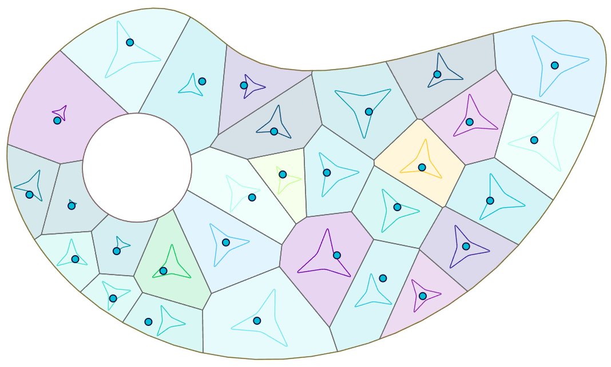
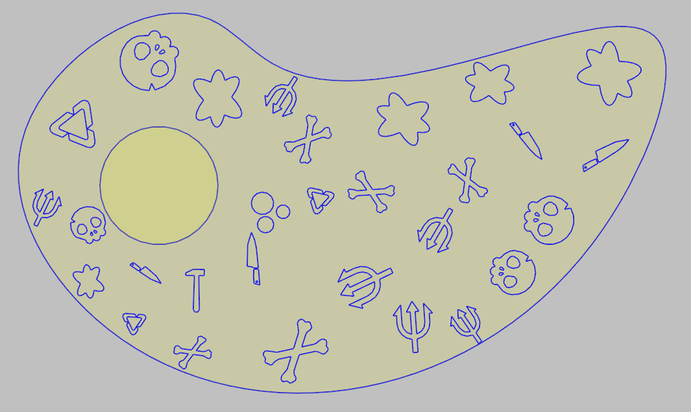

# Solid Edge Voronoi Generator

A WinForms VB.NET application for generating, editing, previewing, and exporting Voronoi-based geometric patterns. The program supports both a standard rectangular working domain and closed sketch profiles imported from Solid Edge, including regions with inner holes.

## Overview

The application generates Voronoi cells from editable seed points and displays them on an interactive canvas with multiple rendering modes. It also includes a shared export pipeline that converts the visible result into geometric paths suitable for SVG, DXF, and Solid Edge sketch output.

## Main Features

- Generate Voronoi diagrams inside the default rectangular domain.
- Read closed sketch profiles from the active Solid Edge sketch and use them as generation boundaries.
- Support multiple outer loops and hole regions inside imported sketch domains.
- Edit seed points interactively on the canvas and rebuild the geometry after changes.
- Render cells as straight edges, curved inner paths, circles, regular polygons, and star-based symbols, including Star, Star3, and Star4.
- Import Solid Edge block definitions and use them as cell symbols.
- Import and faithfully reconstruct ellipses, circles, elliptical arcs, and B-spline curves.
- Scale and rotate individual cell symbols and blocks directly with the mouse wheel.
- Preserve symbol orientation while dragging seeds, with no angle recalculation during the drag.
- Export the generated geometry to SVG, DXF, or directly to the active Solid Edge sketch.
- Export only the currently visible layers to SVG (selective export).
- Send block-based cells to Solid Edge as native block occurrences.

## User Interface

The main window combines a compact control sidebar on the left with a large drawing canvas on the right. The sidebar exposes generation parameters, rendering options, sketch import controls, and export commands, while the canvas is responsible for visualization and direct seed manipulation.

## Random Voronoi Generation

The default workflow creates Voronoi seed points inside a rectangular domain defined in the main form and optionally applies relaxation passes before building the final cells. This provides a fast way to explore procedural layouts before moving to constrained CAD-oriented domains.

## Sketch Profile Import

When Solid Edge is running with an active sketch, the application can read lines, arcs, and circles, reconstruct closed loops, and classify them into outer boundaries and holes. Those loops are then converted into sketch domains used to constrain Voronoi generation inside the imported profile.

## Solid Edge Block Import

Block definitions contained in the active sketch can be imported and used as cell symbols. Each block is read as native geometry and distributed across the cells, so the same drawing can be filled with custom shapes (logos, icons, mechanical symbols) instead of the built-in primitives. Per-cell scale and rotation can then be adjusted individually (see Symbol and Block Scaling).

## Curve Import (Ellipses, Elliptical Arcs, and B-Splines)

Beyond lines and arcs, the import recognizes and reconstructs complex curves:

- Ellipses and circles are kept as native entities rather than being split into arcs.
- Elliptical arcs are reconstructed using their orientation, so the arc follows the correct side and sweep.
- B-spline curves are read from their interpolation nodes. In the preview the curve is approximated with a C2 cubic spline (natural for open curves, periodic for closed ones) that closely matches the original Solid Edge curve, while export recreates the native curve.

## Seed Editing

Seed points can be edited directly on the canvas, allowing local refinement of the generated pattern without restarting the whole process. After a seed edit, the form updates the current seed list and rebuilds the Voronoi cells from the edited positions.

While a seed is being dragged, the random orientation of symbols is **not** recalculated: symbols keep their angle as the cell changes shape, which avoids flickering and continuous spinning. The orientation is refreshed only when the drag is released.

## Rendering Styles

The rendering system supports several `CellRenderStyle` modes, including Straight, Curved, Circle, Square, RoundedSquare, Triangle, Pentagon, Hexagon, Octagon, Star, Star3, and Star4, plus imported Solid Edge blocks as cell symbols. Inner curve and symbol corner behavior can be controlled independently with sharp, Bezier, or fillet-arc handling depending on the selected mode. Supported geometry types include lines, arcs, cubic Beziers, circles, ellipses, elliptical arcs, and B-spline curves.

## Symbol and Block Scaling

Each symbol or block can be resized and rotated individually by hovering its cell:

- **Mouse wheel** scales the symbol/block of the cell under the cursor.
- **Shift + Mouse wheel** rotates it.

Manual per-cell adjustments persist across partial rebuilds and are reset only by a new generation, while the global sliders preserve the relative manual edits.

## Export Output

The export pipeline converts the current visual result into line, arc, ellipse, elliptical-arc, circle, B-spline, and cubic Bezier segments, making the output reusable across multiple destinations. The same exported geometry can be saved as SVG, written as DXF, or sent directly into the active Solid Edge sketch.

### Selective SVG Export

The SVG export reflects exactly what is visible on the canvas according to the active checkboxes (sketch boundary, cell fill, outer edges, inner curves/symbols, seeds). Turning a layer off removes it from the exported file, so the SVG matches the on-screen result.

### Blocks Exported as Block Occurrences

When sending to Solid Edge with the "To SE as blocks (occurrences)" option enabled, cells based on a block are inserted as native block occurrences that reuse the existing block definition, instead of flattened geometry. All other cells are sent as native geometry.

## Workflow

1. Open the application and choose a rendering style.
2. Generate a random Voronoi diagram, import a closed sketch profile, or import block definitions from Solid Edge.
3. Adjust cell count, seed, relaxation, scaling, offset, trim, bulge, and symbol options from the sidebar.
4. Refine the layout by dragging seed points, and fine-tune individual symbols/blocks with the mouse wheel (Shift + wheel to rotate).
5. Export the final geometry to SVG, DXF, or Solid Edge (optionally sending blocks as occurrences).

## Project Structure

Typical source files in the project include:

- `MainForm.vb` — main UI, command flow, sketch import, and export actions.
- `VoronoiCanvas.vb` — drawing surface, rendering logic, and interactive seed editing.
- `VoronoiEngine.vb` — seed creation, Voronoi construction, and relaxation logic.
- `Geometry.vb` — shared geometric helper functions.
- `SolidEdgeExporter.vb` — Solid Edge interoperability for sketch reading and export.
- `ExportGeometry.vb` — conversion of rendered cells into exportable paths.
- `SvgExporter.vb` — SVG output, including selective layer export.
- `DxfExporter.vb` — DXF output.

## Requirements

- Windows with support for VB.NET WinForms execution.
- Solid Edge installed and running for sketch import and direct CAD export features.
- An active Solid Edge document with an active sketch when using sketch-boundary import.

## Notes

The application is designed as a practical geometry authoring tool rather than only a visual experiment. Because rendering, editing, and exporting all rely on shared geometric representations, the result seen on screen can be transferred to CAD-oriented outputs with minimal manual reconstruction.
