# Solid Edge Voronoi Generator

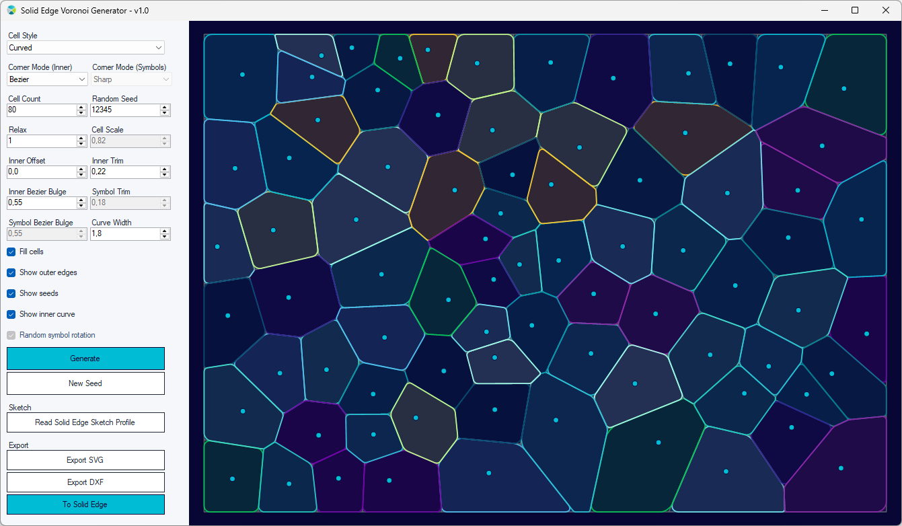

A WinForms VB.NET application for generating, editing, previewing, and exporting Voronoi-based geometric patterns. The program supports both a standard rectangular working domain and closed sketch profiles imported from Solid Edge, including regions with inner holes. Patterns can be refined cell by cell, saved as complete project files, and exported to SVG, DXF, PNG, or directly into a Solid Edge sketch - as raw geometry or as block occurrences.

## Overview

The application generates Voronoi cells from editable seed points and displays them on an interactive canvas with zoom, pan, per-cell editing, and multiple rendering modes. A shared export pipeline converts the visible result into geometric paths suitable for SVG, DXF, PNG, and Solid Edge sketch output. Everything that defines a pattern - settings, sketch profile, seeds with their per-cell properties, and imported blocks - can be stored in a single project file.

## Main Features

- Generate Voronoi diagrams inside the default rectangular domain or inside closed sketch profiles read from Solid Edge (multiple outer loops and holes supported).
- Project files (`.sevproj`): New / Open / Save from the toolbar, storing settings, sketch profile, seeds with per-cell properties, and blocks in one file. The title bar shows the open project and unsaved changes (`*`), and closing prompts to save.
- Edit seed points interactively on the canvas: drag, add, remove, and rebuild the geometry after every change.
- Select a single cell and fine-tune it from the SELECTED CELL panel or with mouse-wheel shortcuts: per-cell scale, rotation, and symbol.
- Pin seeds so they survive regeneration: pinned cells keep position, style, scale, rotation, and symbol when a new diagram is generated.
- Zoom and pan the canvas with Solid Edge-style mouse gestures, with one-click view reset.
- Render cells as straight edges, curved inner paths, circles, regular polygons, star symbols, or imported Solid Edge blocks.
- Block library: read block definitions from the active Solid Edge document, load and save block sets (`.sevb`), preview them in a gallery window, and use them as cell symbols.
- Export to SVG, DXF, PNG (2000 px), or directly into the active Solid Edge sketch - optionally as block occurrences instead of raw geometry.
- Dark and light theme with fully themed custom controls, switchable at runtime and remembered across sessions.
- User settings and collapsed-section state persisted in `%AppData%\SE-Voronoi\settings.txt`.

## User Interface

The main window is organized in three areas:

- A horizontal toolbar at the top with all the actions, grouped as PROJECT (New, Open, Save), GENERATE (Generate, New Seed), SKETCH & BLOCKS (Read Sketch, Read SE Blocks, Load, Save, Clear, Library), and EXPORT (SVG, DXF, PNG, To Solid Edge). The dark-theme toggle and the Help window live on the right side.
- A sidebar on the left containing only parameters, organized in collapsible sections (GENERATION, STYLE, DISPLAY, EXPORT, SELECTED CELL) whose open/closed state is remembered.
- The interactive canvas, with a status bar at the bottom.

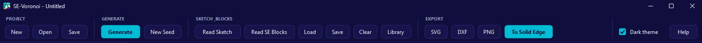

### Themes

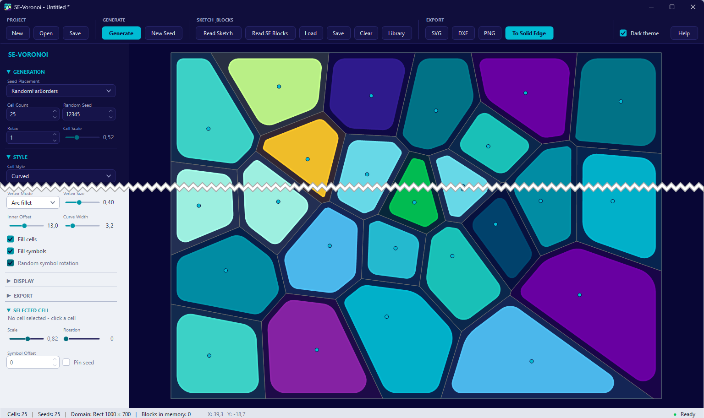

The whole interface - including the title bar, custom sliders, combo boxes, checkboxes, scrollbars, and the secondary windows (Block Library, Help) - follows the selected theme. The canvas background stays navy in both themes because the cell palette is designed for it. The toggle is in the toolbar and the choice is persisted.

## Project Files

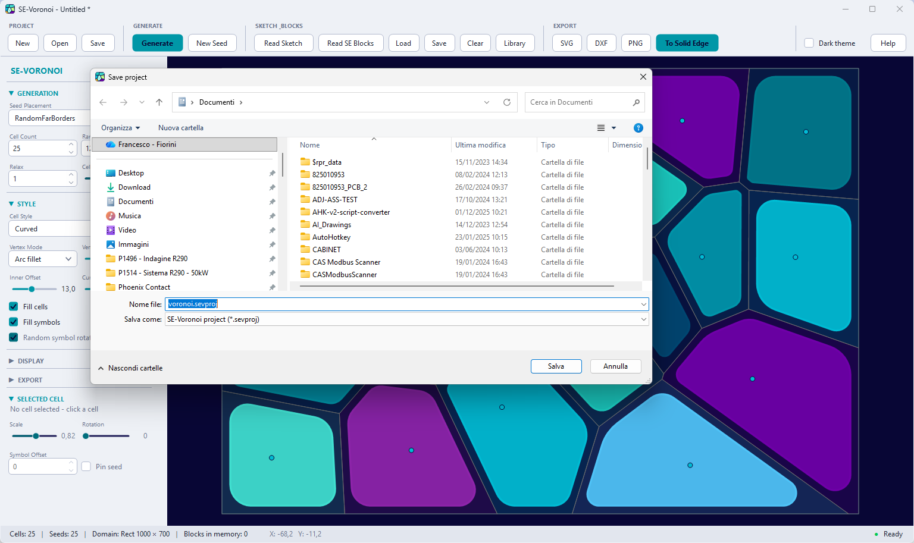

A project file (`.sevproj`) captures the complete state of a pattern: all parameters, the imported sketch profile (loops, holes, and generation regions), every seed with its per-cell style, scale, rotation, symbol offset and pin flag, and the current block library. Reopening a project restores the exact layout without regeneration. Unsaved changes are tracked (`*` in the title bar) and the application asks to save on New, Open, and exit.

## Random Voronoi Generation

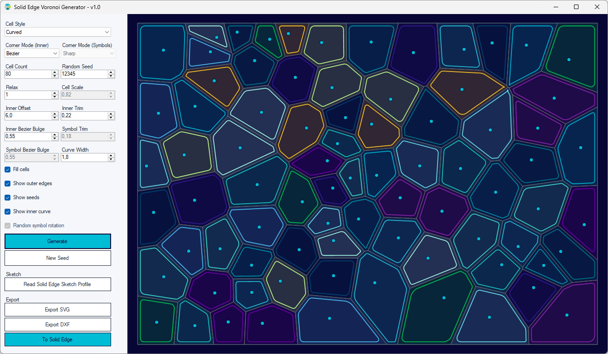

The default workflow creates Voronoi seed points inside a rectangular domain and optionally applies relaxation passes before building the final cells. Pinned seeds are preserved: regeneration only replaces the unpinned ones.

## Sketch Profile Import

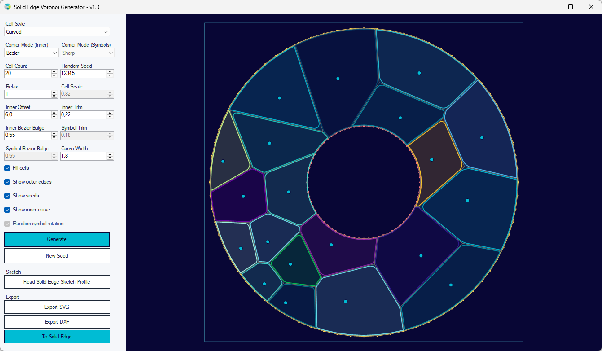

When Solid Edge is running with an active sketch, the application reads lines, arcs, and circles, reconstructs closed loops, and classifies them into outer boundaries (yellow) and holes (red). Those loops become generation domains: seeds are constrained inside the profile and cells are clipped against the holes. Cell count is distributed between multiple regions proportionally to their area.

## Canvas Navigation

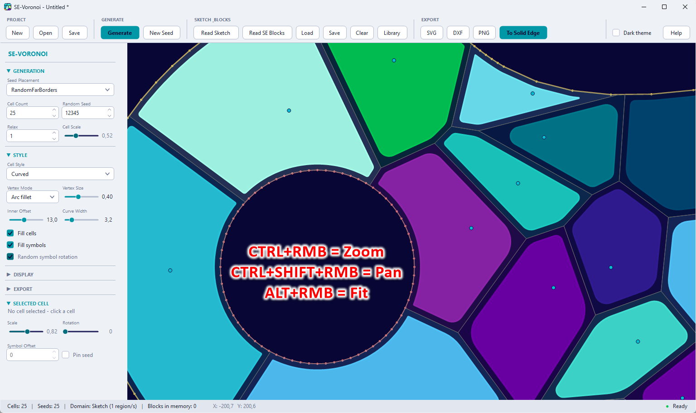

The canvas supports Solid Edge-style navigation: CTRL + right-drag zooms anchored at the cursor, CTRL + SHIFT + right-drag pans (SHIFT can be toggled mid-gesture), and ALT + right-click resets the view. PNG export always renders the whole domain regardless of the current zoom.

## Seed Editing

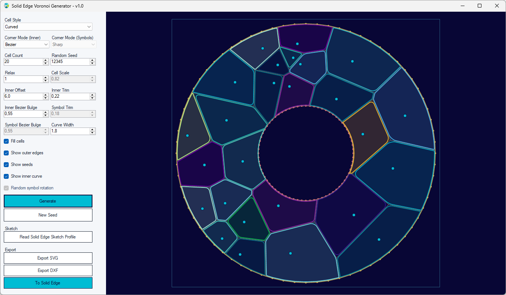

Seed points can be edited directly on the canvas: drag to move, CTRL + click or double-click to add, right-click to remove. After every edit the seed list is updated and the Voronoi cells are rebuilt from the edited positions.

## Cell Selection and Per-Cell Editing

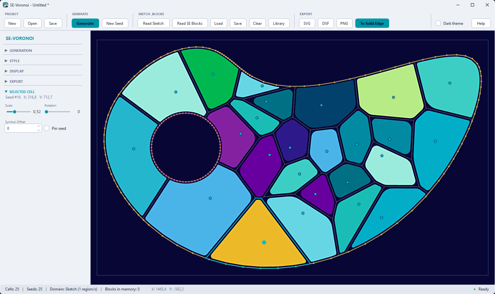

Clicking a cell (or its seed) selects it: the cell is outlined and the SELECTED CELL sidebar section shows its properties. Scale, rotation, and symbol can be changed per cell from the panel or directly with the mouse wheel over the cell (wheel = scale, SHIFT + wheel = rotate, CTRL + wheel = cycle symbol).

### Pinned Seeds

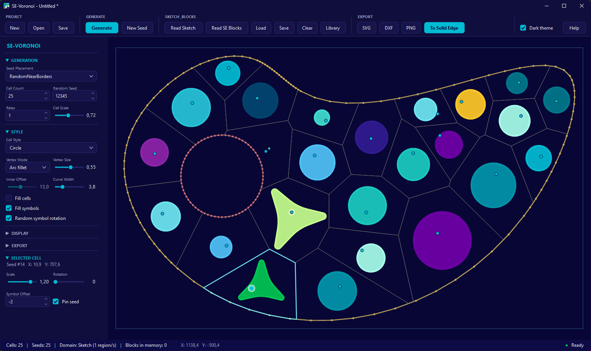

A selected cell can be pinned (white ring around its seed). Pinned seeds cannot be dragged accidentally and survive regeneration with all their per-cell properties, making it possible to lock refined areas while re-rolling the rest of the pattern.

## Rendering Styles

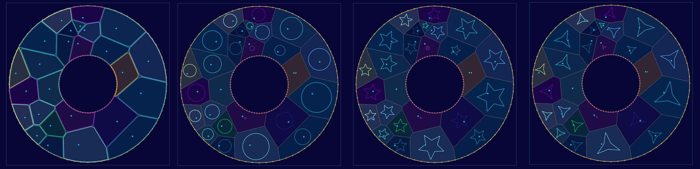

The rendering system supports several `CellRenderStyle` modes, including Straight, Curved, Circle, Square, RoundedSquare, Triangle, Pentagon, Hexagon, Octagon, Star, Star3, Star4, and Solid Edge blocks. Inner curve and symbol corner behavior can be controlled independently with sharp, Bezier, or fillet-arc handling. Styles can also be mixed per cell through the selection tools.

## Block Library

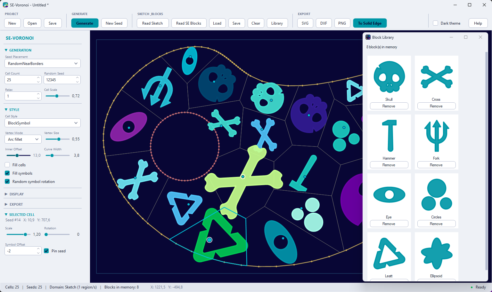

Block definitions can be imported from the active Solid Edge document (deduplicated by name), loaded from and saved to `.sevb` files, and browsed in the Block Library window with rendered previews and per-block removal. Imported blocks become available as cell symbols and travel with the project file.

## Export Output

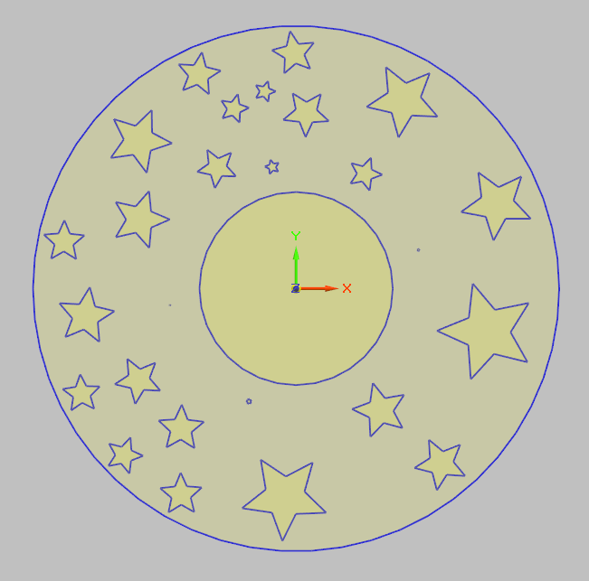

The export pipeline converts the current visual result into line, arc, and cubic Bezier segments, reusable across all destinations: SVG and DXF vector files, a 2000 px PNG image, or the active Solid Edge sketch. With "To SE as blocks" enabled, cells based on blocks are sent as block occurrences (missing definitions are created automatically) instead of raw geometry.

## Help

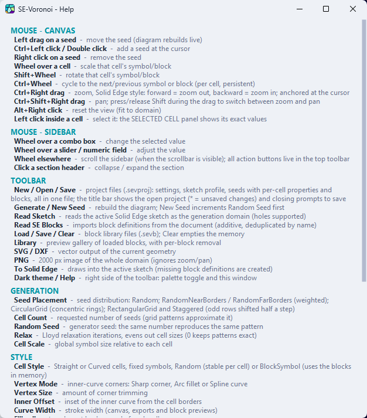

A modeless, themed Help window documents every mouse gesture, toolbar command, and sidebar parameter.

## Mouse and Keyboard Controls

| Context | Input | Action |
| --- | --- | --- |
| Canvas | Left-drag on seed | Move seed |
| Canvas | CTRL + left-click / double-click | Add seed |
| Canvas | Right-click on seed | Remove seed |
| Canvas | Left-click on cell | Select cell |
| Canvas | Wheel over cell | Per-cell scale |
| Canvas | SHIFT + wheel over cell | Per-cell rotation |
| Canvas | CTRL + wheel over cell | Cycle cell symbol |
| Canvas | CTRL + right-drag | Zoom (anchored at cursor) |
| Canvas | CTRL + SHIFT + right-drag | Pan |
| Canvas | ALT + right-click | Reset view |
| Sidebar | Wheel | Scroll (when scrollbar visible) |

## Workflow

1. Open the application, or open an existing `.sevproj` project.
2. Choose a rendering style and generate a random diagram, or import a closed sketch profile from Solid Edge.
3. Adjust cell count, seed, relaxation, scaling, offset, trim, bulge, and symbol options from the sidebar.
4. Refine the layout: drag seeds, select cells to tune scale/rotation/symbol, and pin the cells to keep.
5. Optionally import Solid Edge blocks and use them as cell symbols.
6. Save the project, then export the final geometry to SVG, DXF, PNG, or Solid Edge.

## Project Structure

Typical source files in the project include:

- `MainForm.vb` - main UI, toolbar, project files, theming, sketch import, block library, and export actions.
- `VoronoiCanvas.vb` - drawing surface, rendering logic, zoom/pan, selection, and interactive seed editing.
- `VoronoiEngine.vb` - seed creation, Voronoi construction, hole clipping (Clipper2), and relaxation logic.
- `Geometry.vb` - shared geometric helper functions.
- `SolidEdgeExporter.vb` - Solid Edge interoperability for sketch reading, block reading, and export.
- `ExportGeometry.vb` - conversion of rendered cells into exportable paths and block file I/O.

Distribution consists of the executable plus `Clipper2Lib.dll`.

## Requirements

- Windows with .NET Framework 4.8.1.
- `Clipper2Lib.dll` next to the executable.
- Solid Edge installed and running for sketch import, block import, and direct CAD export features.
- An active Solid Edge document with an active sketch when using sketch-boundary import or sketch export.

## Notes

The application is designed as a practical geometry authoring tool rather than only a visual experiment. Because rendering, editing, and exporting all rely on shared geometric representations, the result seen on screen can be transferred to CAD-oriented outputs with minimal manual reconstruction.
